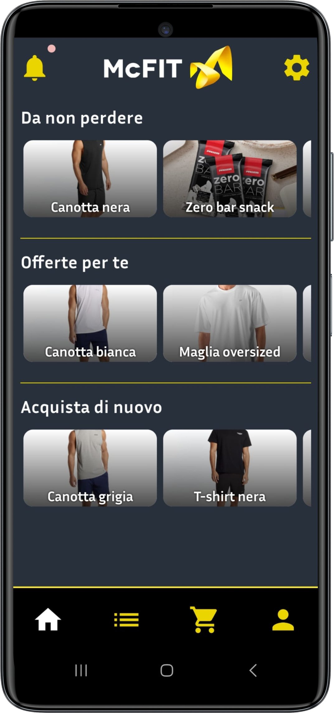
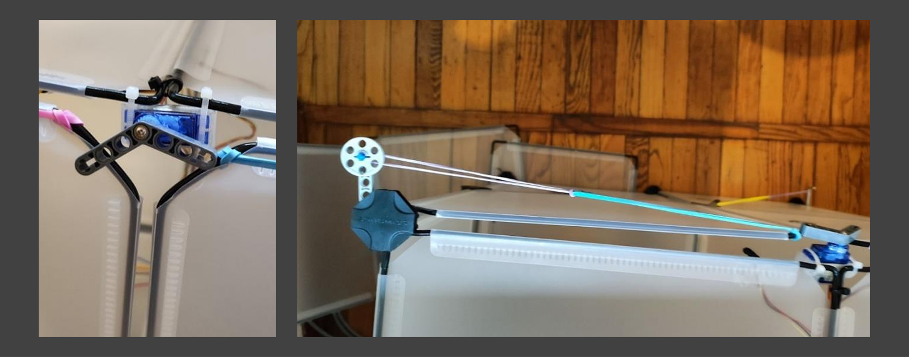
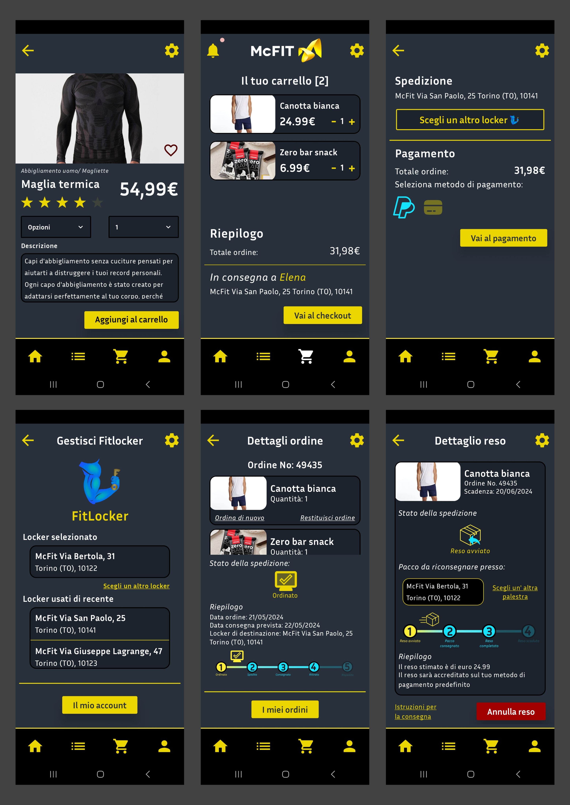
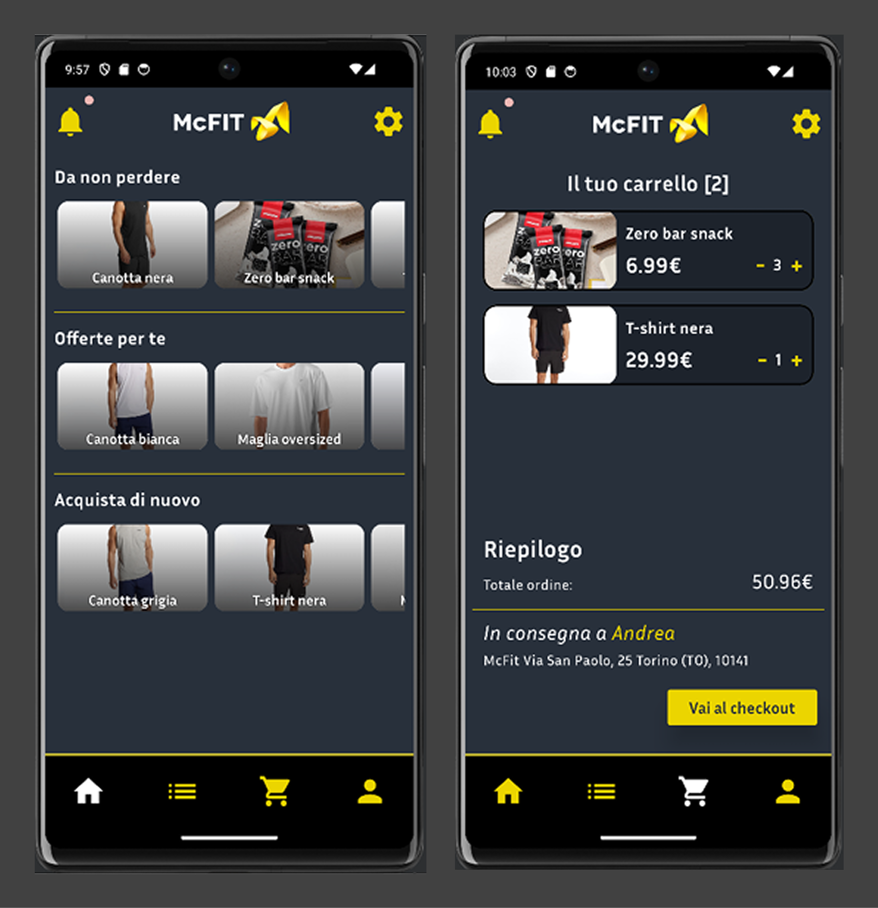

# 🏋️ FitLocker - The smart locker for your gym

**FitLocker** is an integrated system (mobile app + physical smart locker) designed to simplify the delivery and pickup of fitness-related online purchases directly within the gym.

Developed through a 360-degree approach that includes user research, hardware prototyping, and native Android development, FitLocker aims to solve the logistical problems related to receiving supplements, sportswear, and equipment. The system offers dedicated interfaces for both the end user (the gym client) and the courier.

By leveraging real-time database synchronization, the platform ensures a seamless communication flow between the client, the courier, and the physical locker hardware. The system automatically assigns the appropriate locker compartment based on the order size and generates secure unlock codes, creating a frictionless pick-up experience right after a workout.

 

---

## 🔍 Overview and Exploration

Click on the sections below to discover the details of the UX design process, software development, hardware prototyping, and main features.

<b>🛠️ 1. UX Design & Social Research Process</b>

 

The project started with a brainstorming phase and market analysis to identify the ideal context for a smart locker, choosing to conceptually collaborate with the **McFit** chain.

* **Survey and Needfinding:** We distributed a questionnaire to understand users' habits regarding the online purchase of fitness products. The data confirmed the high relevance of these products and the usefulness of a dedicated pickup point.
* **Prototyping:** The design team created low-fidelity sketches and high-fidelity interactive prototypes on **Figma**.
* **UI Design:** A custom color palette was implemented reflecting the McFit brand (dark grey, yellow), along with consistent typography ("Segoe UI") and custom icons.

*(Overview of the Figma workspace with interaction flows)*

<b>💻 2. Software Development (Android App)</b>

 

The mobile application was developed natively for Android using a modern technology stack.

* **Frontend:** Use of `Jetpack Compose` for the UI, leveraging components like `NavGraph` for navigation, and various `Modifier`s for styling and animations.
* **Backend and Logic:** The app's logic is structured to handle both the **Client** and **Courier** flows within the same application, differentiating them during the login phase (using specific email domains).
* **Database and Storage:** Use of `Firebase Realtime Database` and `Firebase Storage` to manage users, products, orders, and returns in real-time.

<b>⚙️ 3. Hardware Prototyping (Smart Locker)</b>

 

The project included the physical construction and programming of a fully functional smart locker prototype.

* **Structure:** A physical structure consisting of two compartments (a large upper one and a small lower one).
* **Electronics:** Managed by an **Arduino UNO** and an **ESP8266** microcontroller (set as master and slave).
* **Components:** Equipped with two servomotors (housed in 3D printed supports) for the locking mechanism, three Hall effect sensors (with magnets) to detect door status, a keypad, and a display.
* **Connectivity:** The ESP8266 connects to Wi-Fi to authenticate on Firebase and monitor real-time data, allowing remote unlocking via the app.

  
   
  <i>(Close-up of the hardware: the servomotors with custom 3D-printed mounts and the elastic lever system for automatic door opening)</i>

<b>📱 4. Main Features and Flows</b>

 

The system manages the entire lifecycle of an order through two distinct interfaces and a smart assignment algorithm:

**🛒 Client App (E-commerce & Management)**
Users can explore the catalog, customize products, manage their cart, and proceed to checkout. A key feature is the physical locker selection during the purchase. The app also tracks the order timeline and handles returns.

  
   
  <i>(Overview of the Client App: from product selection and checkout to locker management, order tracking, and returns)</i>

**📦 Courier App (Delivery Logistics)**
A dedicated interface for couriers to view pending deliveries, confirm the drop-off at the selected locker, and update the database in real-time. This action triggers the generation of the unlock code for the end user.

  
   
  <i>(The Courier interface: managing pending deliveries and confirming drop-offs at the smart locker)</i>

**🧠 Smart Locker Logic (Automated Assignment)**
Behind the scenes, the system handles the physical constraints of the locker. It automatically assigns the appropriate compartment (Large or Small) based on the order size (number of items) and real-time availability. If both compartments are occupied, the system prevents the checkout and notifies the user via a popup.

  

> 💡 **Want to dive deeper?** Read our full **[Project Report (PDF)](docs/FitLocker_Report.pdf)** to explore the complete UX research, hardware schematics, and software architecture.

---

*Project created for the Digital Interaction Design course (A.Y. 2023/24) at Politecnico di Torino.*

*Credits: Mattia Ambrosini, Anna Bondi, Andrea De Luca, Annamaria Flumero, Katia Grasso.*
